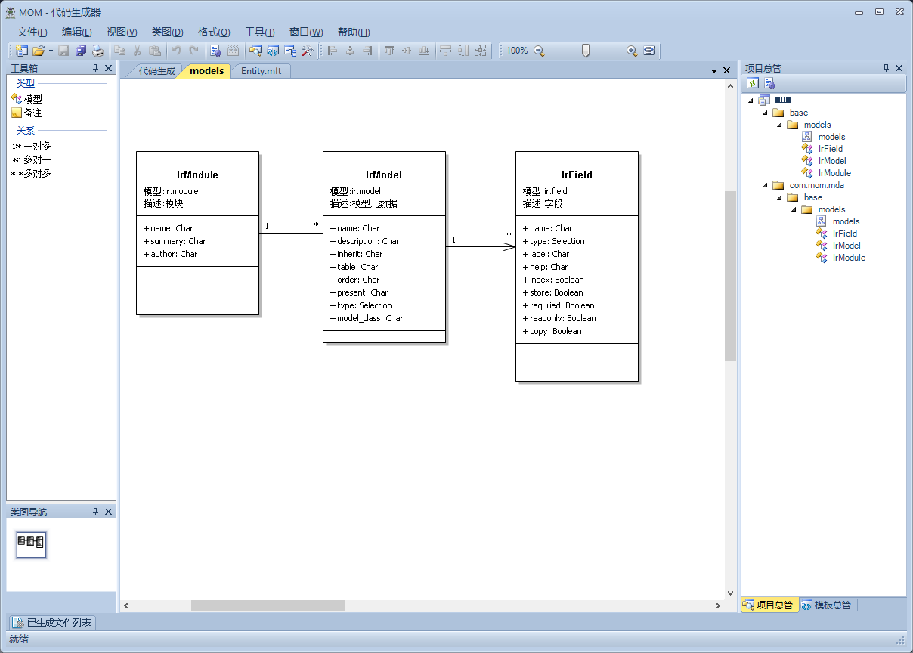

### Java版本odoo


###  核心设计思想
    一切皆模型，所有模型皆可扩展

### 开源协议
    LGPL v3.0

### 模型示例代码

```java
package org.jdoo.models;

import org.jdoo.*;

@Entity(name = "test.model", description = "模型元数据")
public class TestModel extends Model {
    static Field name = Field.Char().label("名称").help("模型名称")
        .index(true).required(true);//.translate();
    static Field description = Field.Char().label("描述").help("模型说明");
    static Field inherit = Field.Char().label("继承").help("模型的继承，多个使用逗号','分隔");
    static Field type = Field.Selection().label("类型").help("模型的类型：普通、抽象、瞬态");
    static Field type_name = Field.Char().label("类名")
        .compute(Callable.script("r->r.get('name')+'('+r.get('type')+')'"))
        .store(false).depends("name", "type");

    /** 名称 */
    public String getName() {
        return (String) get(name);
    }

    /** 名称 */
    public void setName(String value) {
        set(name, value);
    }

    /** 描述 */
    public String getDescription() {
        return (String) get(description);
    }

    /** 描述 */
    public void setDescription(String value) {
        set(description, value);
    }

    /** 继承 */
    public String getInherit() {
        return (String) get(inherit);
    }

    /** 继承 */
    public void setInherit(String value) {
        set(inherit, value);
    }

    /** 类型 */
    public String getType() {
        return (String) get(type);
    }

    /** 类型 */
    public void set_type(String value) {
        set(type, value);
    }	

    /** 类型 */
    public String getTypeName() {
        return (String) get(type_name);
    }

    /** Model method demo */
    public void test(Records rec) {
        for (TestModel testModel : rec.of(TestModel.class)) {
            testModel.set_type("integer");
            System.out.println(testModel.get_name());
        }
        //do something else
    }
}
```

### 建模工具



### 项目计划

1. 模型引擎

    - 实现模型构建
    - 基础CURD

2. 前端框架

    - 自动生成页面
    - 页面扩展

3. 0代码构建应用

    - 建模型工具构建应用
    - IDE集成

4. 服务编排

    - 工作流
    - 业务流


